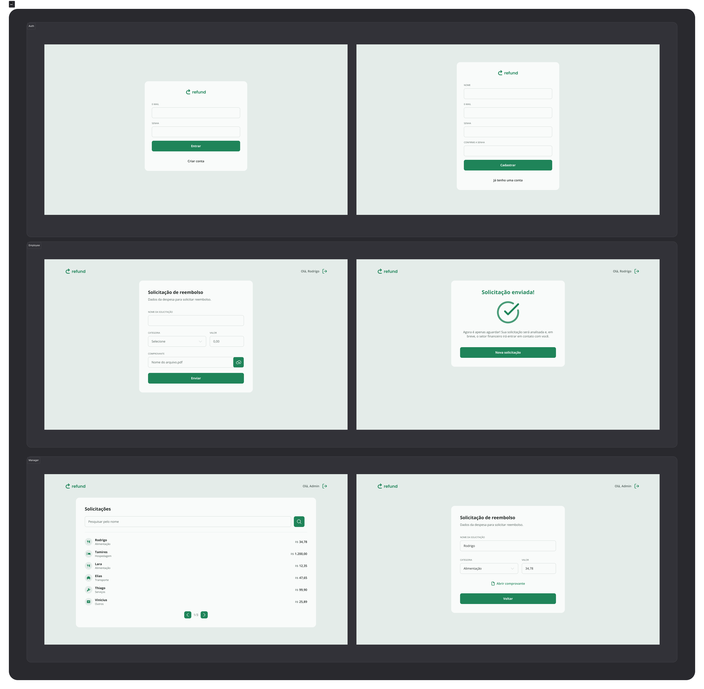
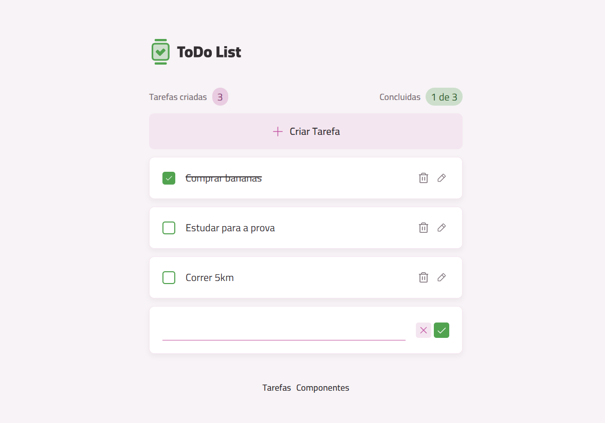

# React Projects Collection

Este repositório contém três projetos demonstrativos desenvolvidos com **React** e tecnologias modernas.

| Projeto | Resumo | Miniatura |
|---|---|---|
| [**Calculadora React**](./calculadora) | Aplicação de calculadora simples em **React + Vite** que demonstra o uso da **Context API**, componentização modular, gerenciamento de estado local com `useState`, persistência via **localStorage**, e estilos modernos com **Tailwind CSS**. | 
| [**Sistema de Reembolso**](./sistema-de-reembolso) | Sistema fullstack para criação e consulta de solicitações de reembolso, com **frontend** em **React + Vite + TypeScript** e **backend** em **Node.js + TypeScript (Rocketseat)**. Utiliza **JWT** para autenticação, upload de arquivos, validação com **Zod**, e **Prisma** como ORM. | 
| [**Todo List**](./todo) | Aplicação de gerenciamento de tarefas desenvolvida com **React + TypeScript + Vite**. Permite criar, editar, concluir e excluir tarefas, exibir um resumo dos totais e persistir os dados no navegador com **localStorage**, com interface responsiva e componentes reutilizáveis. | 

---

## Como usar

- Cada pasta contém seu próprio README com instruções detalhadas para rodar o projeto.
- Veja a seção **Instalação** nos README individuais para mais detalhes.
